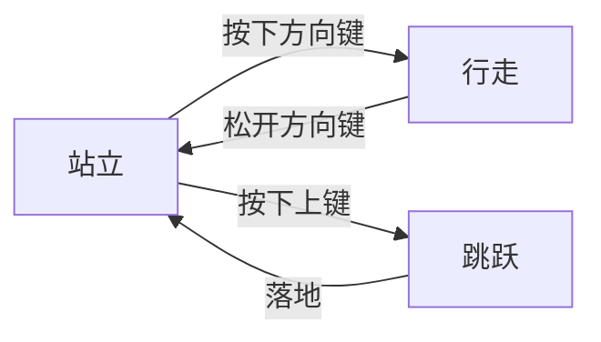
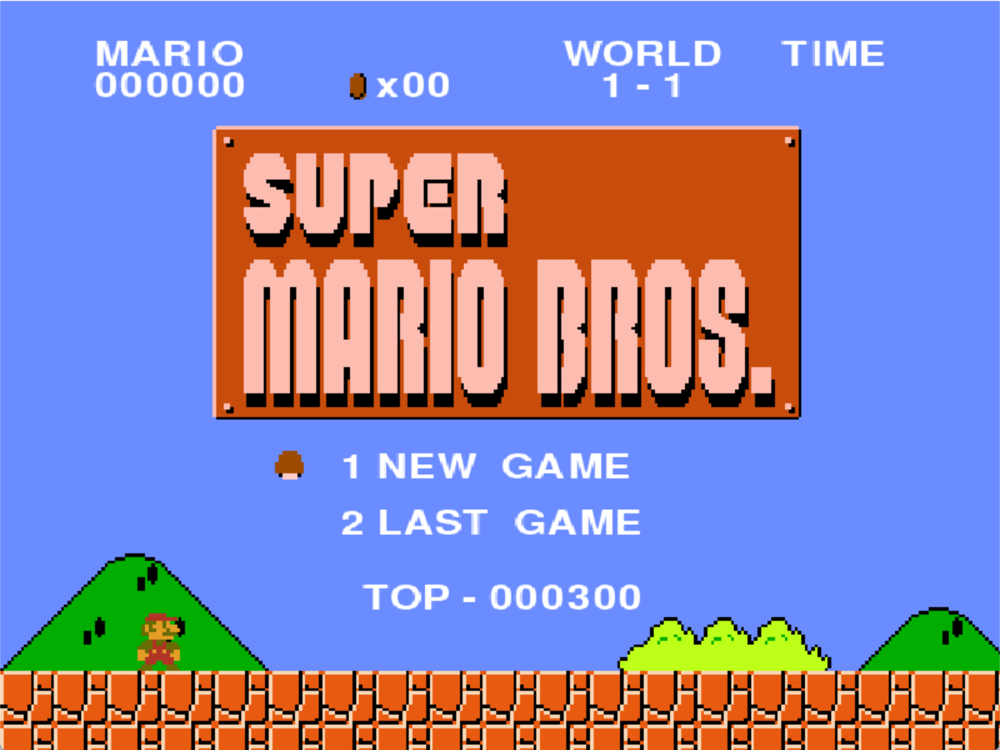
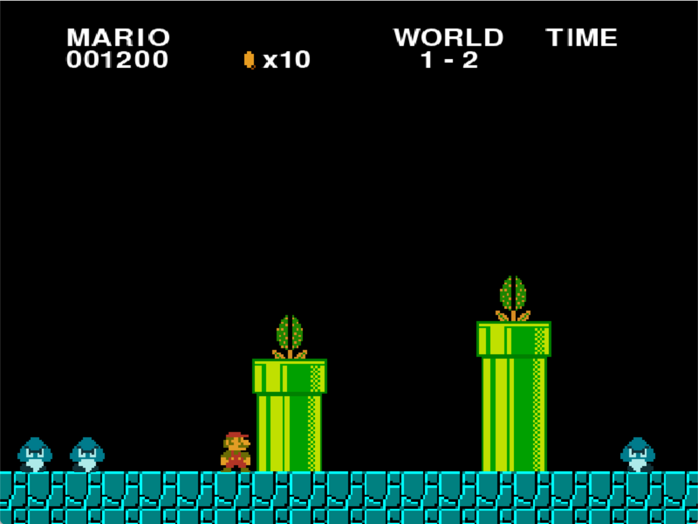
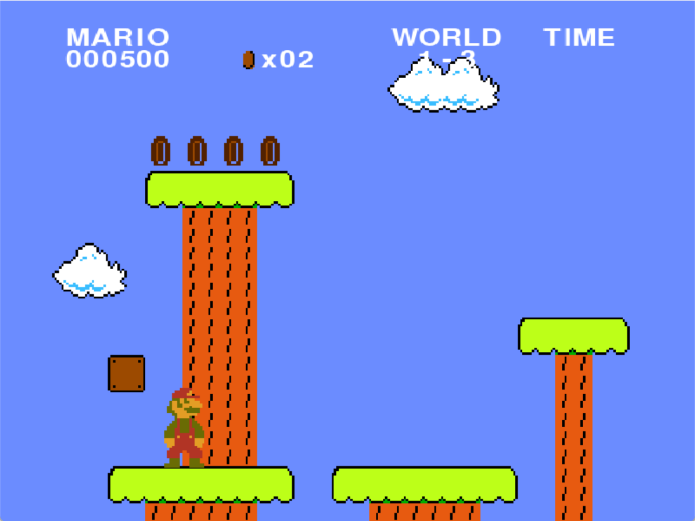
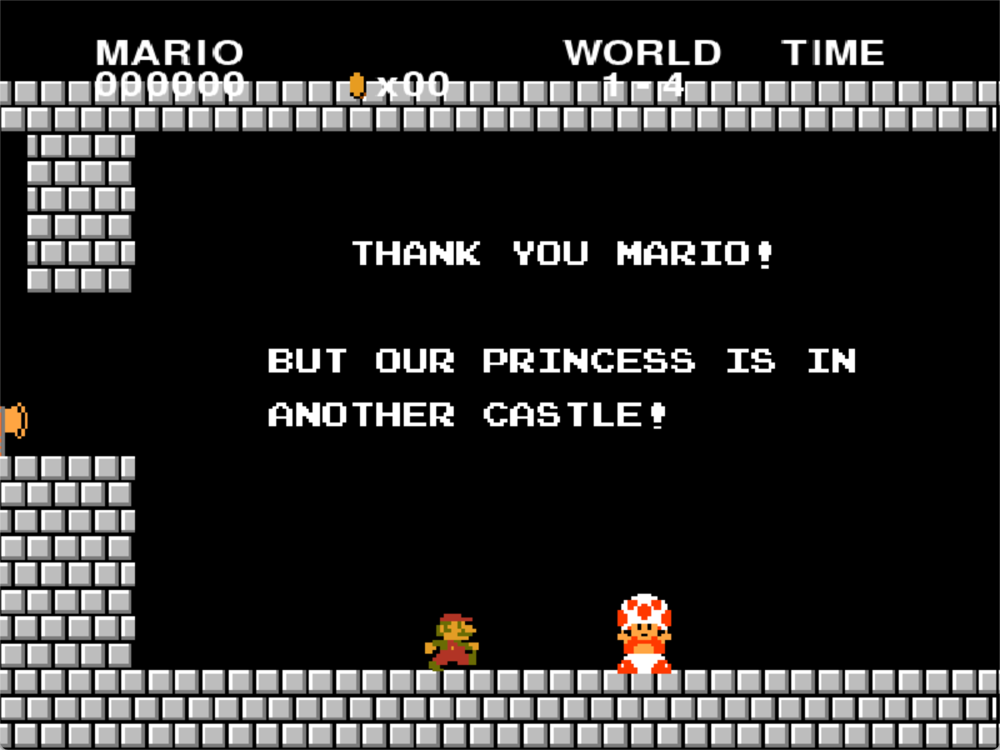
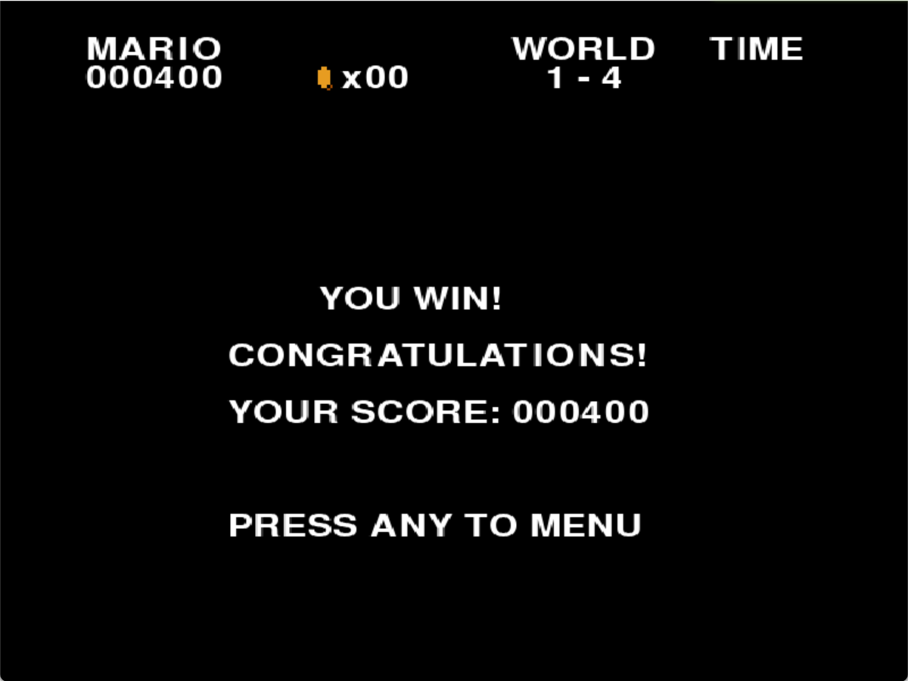
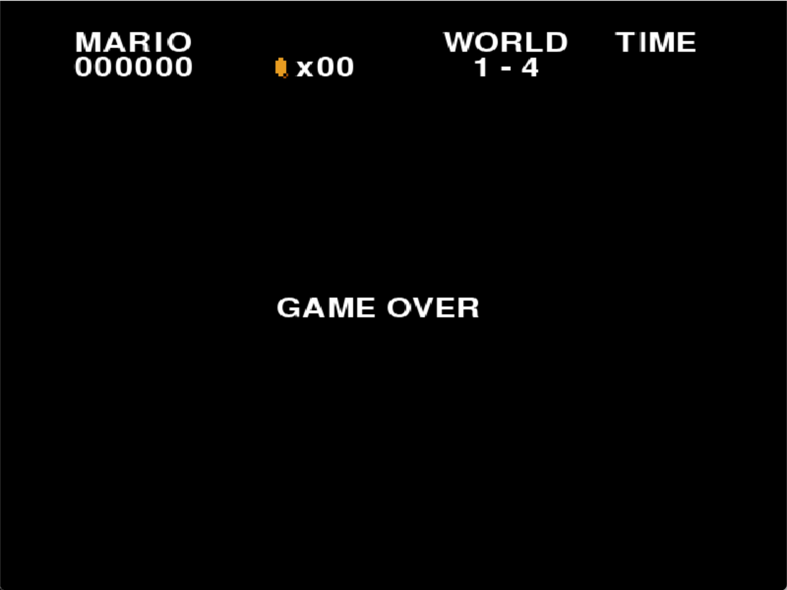

# 综合课程设计报告

## 摘要

超级马里奥是任天堂公司于1985年推出的经典平台游戏，开创了横版卷轴游戏的先河。本系统基于Python 3.9和Pygame 2.6框架，采用面向对象技术完整实现了游戏的核心机制。系统包含角色控制模块(移动、跳跃、碰撞)、敌人AI行为模块(移动模式、攻击逻辑)、道具系统(金币收集、能力提升)以及关卡管理系统。通过优化算法实现了高效的碰撞检测，帧率稳定在60FPS。系统还扩展了多关卡设计、游戏状态管理、生命值系统等进阶功能，显著提升了游戏的可玩性和用户体验。

本系统采用模块化设计，主要分为游戏主循环模块、状态管理模块、游戏组件模块和工具模块。关键技术包括：1)基于Pygame的事件驱动主循环；2)矩形碰撞检测算法；3)状态模式实现游戏流程管理；系统运行稳定，已在Windows 11平台完成全面测试。

关键词：超级马里奥；Python；Pygame；碰撞检测；状态管理；游戏物理引擎；动画系统；性能优化

## 第一章 绪论

### 1.1 项目完成情况

本项目较完整实现了超级马里奥游戏的基本功能，包括角色移动、碰撞检测、关卡切换等核心机制，在此基础上完成了积分系统，音效系统，玩家到画面的1/3画面才开始移动，玩家通过道具变身火焰马里奥，巨大马里奥，火焰马里奥通过发射火球击杀怪物，通过顶起或者踩死怪物，koopa（乌龟）的踩踏后切换龟壳状态撞死怪物，食人花检测玩家位置隐藏，检查点技术控制怪物生成时间，顶起宝箱获得金币，结尾的跳上旗杆滑动动画，实现存档功能，达到了课程设计的要求。

### 1.2 超级马里奥游戏介绍

#### 1.2.1 历史与发展

超级马里奥是任天堂公司于1985年推出的经典平台游戏，开创了横版卷轴游戏的先河，对后续游戏设计产生了深远影响。

#### 1.2.2 操作方式

玩家通过键盘方向键控制马里奥移动，上键跳跃，与游戏中的敌人、道具和场景元素进行交互，当处于火焰马里奥的时候按d键可以射出火球击杀怪物,按s键可以加速，第三关有处地方需要加速跳过去，关卡中间按下Q键存档

### 1.3 Pygame开发框架介绍

Pygame是Python的游戏开发库，提供了图形渲染、声音播放、输入处理等功能，适合开发2D游戏。

### 1.4 运行环境

**python库环境：**pygame 2.6.1 (SDL 2.28.4, Python 3.9.21)

**系统环境：**Windows11

**硬件环境：**13th Gen Intel(R) Core(TM) i9-13900HX，2200 Mhz，24 个内核，32 个逻辑处理器

### 1.5 项目下载

开源在了[yangqy171/python_supermario: 实现超级玛丽的部分功能](https://github.com/yangqy171/python_supermario)，欢迎下载

### 1.6 项目结构

```
SuperMario
├─ 📁assets
│  ├─ 📄image-20250426013250416-1746948514620-1.png
│  ├─ 📄image-20250426013250416.png
│  ├─ 📄image-20250505213306609-1746948514622-3.png
│  ├─ 📄image-20250505213306609.png
│  ├─ 📄image-20250505213341477-1746948514622-2.png
│  └─ 📄image-20250505213341477.png
├─ 📁resources
│  ├─ 📁graphics
│  │  ├─ 📄enemies.png
│  │  ├─ 📄item_objects.png
│  │  ├─ 📄level_1.png
│  │  ├─ 📄level_2.png
│  │  ├─ 📄level_3.png
│  │  ├─ 📄level_4.png
│  │  ├─ 📄mario_bros.png
│  │  ├─ 📄smb_enemies_sheet.png
│  │  ├─ 📄text_images.png
│  │  ├─ 📄tile_set.png
│  │  └─ 📄title_screen.png
│  ├─ 📁music
│  │  ├─ 📄death.wav
│  │  ├─ 📄flagpole.wav
│  │  ├─ 📄game_over.ogg
│  │  ├─ 📄invincible.ogg
│  │  ├─ 📄main_theme.ogg
│  │  ├─ 📄main_theme_sped_up.ogg
│  │  ├─ 📄out_of_time.wav
│  │  ├─ 📄stage_clear.wav
│  │  └─ 📄world_clear.wav
│  └─ 📁sound
│     ├─ 📄big_jump.ogg
│     ├─ 📄brick_smash.ogg
│     ├─ 📄bump.ogg
│     ├─ 📄coin.ogg
│     ├─ 📄count_down.ogg
│     ├─ 📄death.wav
│     ├─ 📄fireball.ogg
│     ├─ 📄kick.ogg
│     ├─ 📄main_theme_sped_up.ogg
│     ├─ 📄one_up.ogg
│     ├─ 📄pipe.ogg
│     ├─ 📄powerup.ogg
│     ├─ 📄powerup_appears.ogg
│     ├─ 📄small_jump.ogg
│     └─ 📄stomp.ogg
├─ 📁source
│  ├─ 📁components
│  │  ├─ 📁__pycache__
│  │  │  ├─ 📄box.cpython-39.pyc
│  │  │  ├─ 📄brick.cpython-39.pyc
│  │  │  ├─ 📄coin.cpython-39.pyc
│  │  │  ├─ 📄enemy.cpython-39.pyc
│  │  │  ├─ 📄info.cpython-39.pyc
│  │  │  ├─ 📄player.cpython-39.pyc
│  │  │  ├─ 📄powerup.cpython-39.pyc
│  │  │  └─ 📄stuff.cpython-39.pyc
│  │  ├─ 📄box.py
│  │  ├─ 📄brick.py
│  │  ├─ 📄coin.py
│  │  ├─ 📄enemy.py
│  │  ├─ 📄info.py
│  │  ├─ 📄player.py
│  │  ├─ 📄powerup.py
│  │  └─ 📄stuff.py
│  ├─ 📁data
│  │  ├─ 📁maps
│  │  │  ├─ 📄level_1.json
│  │  │  ├─ 📄level_2.json
│  │  │  ├─ 📄level_3.json
│  │  │  └─ 📄level_4.json
│  │  └─ 📁player
│  │     ├─ 📄luigi.json
│  │     └─ 📄mario.json
│  ├─ 📁states
│  │  ├─ 📁__pycache__
│  │  │  ├─ 📄game_complete.cpython-39.pyc
│  │  │  ├─ 📄level.cpython-39.pyc
│  │  │  ├─ 📄load_screen.cpython-39.pyc
│  │  │  └─ 📄main_menu.cpython-39.pyc
│  │  ├─ 📄game_complete.py
│  │  ├─ 📄level.py
│  │  ├─ 📄load_screen.py
│  │  └─ 📄main_menu.py
│  ├─ 📁__pycache__
│  │  ├─ 📄constants.cpython-39.pyc
│  │  ├─ 📄setup.cpython-39.pyc
│  │  ├─ 📄sound.cpython-39.pyc
│  │  └─ 📄tools.cpython-39.pyc
│  ├─ 📄constants.py
│  ├─ 📄setup.py
│  ├─ 📄sound.py
│  └─ 📄tools.py
├─ 📄main.py
└─ 📄read.md
```

## 第二章 系统分析

### 2.1 功能分析

#### 2.1.1 基本功能

1. 角色移动控制
2. 敌人AI行为
3. 碰撞检测系统
4. 道具收集功能

#### 2.1.2 核心功能实现

1. 游戏主循环在main.py中实现
2. 游戏关卡管理在states/目录下
3. 游戏组件在components/目录下实现

#### 2.1.3 游戏实现原理

1. 使用Pygame处理图形渲染和用户输入
2. 采用面向对象设计实现游戏元素
3. 使用状态模式管理游戏流程
4. 通过不断更新图片并绘制实现游戏运行

#### 2.1.4 拓展功能

1. 多关卡设计
2. 存档系统
3. 音效系统

### 2.2 类关系分析

游戏采用面向对象设计，主要类包括Player(玩家角色)、Enemy(敌人类)、Item(道具类)、Level(关卡类)等，通过继承和组合关系实现游戏功能。

## 第三章 详细设计及实现

### 3.1 场景与视窗

游戏采用Pygame的Surface对象实现场景渲染，视窗大小为800x600像素。

### 3.2 画面

为了实现原作的画面移动（即玩家没走到画布1/3时玩家移动，1/3之后整个画面和玩家一起移动），设置画布，人物绘制在画布上，画布再绘制在屏幕上

- 计算1/3位置点： third=self.game_window.x+self.game_window.width/3
- 当玩家向右移动( x_vel>0 )且中心点超过1/3位置( player.rect.centerx>third )且窗口未到达地图终点( game_window.right<self.end_x )时：
- 移动游戏窗口： game_window.x += player.x_vel
- 更新起始位置： start_x = game_window.x

```python
def update_game_window(self):
    third=self.game_window.x+self.game_window.width/3
    if self.player.x_vel>0 and self.player.rect.centerx>third and self.game_window.right<self.end_x:
        self.game_window.x+=self.player.x_vel
        self.start_x=self.game_window.x
```

实现了三级绘制系统：

将背景绘制到game_ground画布上(只绘制game_window可见区域),将所有游戏对象绘制到game_ground画布上,将game_ground画布的可见区域(game_window)绘制到屏幕上

1)背景 → 2) 游戏对象 → 3) UI信息
这种分层绘制确保了正确的视觉层次和渲染效率。
这种实现方式的好处是：

- 只需要计算和绘制可见区域的内容，提高性能
- 可以轻松实现镜头跟随效果
- 游戏逻辑坐标和屏幕坐标分离，便于处理

### 3.3 马里奥角色类

Player类实现角色移动、跳跃、碰撞检测等核心功能，继承自pygame.sprite.Sprite。

#### 3.3.1 动画系统

角色动画系统基于精灵表(sprite sheet)技术实现，通过状态机管理不同动作的切换。主要功能包括：

1. **帧动画管理**
   - 使用`load_images()`方法加载所有动画帧
   - 将不同状态(小马里奥、大马里奥、火焰马里奥)的动画帧分类存储
   - 通过`set_player_image()`方法切换当前显示的动画帧

2. **状态切换逻辑**
   - 通过`state`属性管理当前状态(站立、行走、跳跃等)
   - 每种状态对应不同的动画帧序列
   - 状态转换通过`handle_state()`方法处理

3. **动画播放控制**
   - 使用`frame_index`记录当前播放的帧
   - `walking_timer`控制行走动画的帧切换速度
   - 通过`calc_frame_duration()`计算帧持续时间
   - 根据角色朝向(`face_right`)决定使用左/右动画帧

4. **特殊动画效果**
   - 大小切换动画通过`small2big()`和`big2small()`实现
   - 使用`transition_timer`控制动画播放节奏
   - 通过`change_player_image()`方法平滑过渡角色形象

5. **技术实现细节**
   - 所有动画帧预加载到内存中
   - 使用`pygame.transform.flip()`生成镜像帧
   - 通过`rect`属性保持角色位置不变
   - 动画帧率动态调整以适应不同移动速度

#### 3.3.2 跳跃设置

实现原理：

- 小跳：短按跳跃键时，给予标准跳跃速度( jump_vel )
- 大跳：长按跳跃键时，通过 anti_gravity 持续给予向上的加速度，延长跳跃时间
- 松开跳跃键( K_UP )时立即切换到下落状态，实现跳跃高度控制
  这种实现方式通过按键时长和反重力参数共同控制跳跃高度，模拟了经典马里奥游戏中的跳跃手感。

#### 3.3.3 状态转化

小变大:设置变形的帧造型列表,当碰撞检测中触发了状态转换,通过设定时间来切换帧,把左和右的帧列表改变设定为变大之后的帧

**时间静止**:为了实现原作中马里奥变身时世界静止的效果,增加一个判断静止的函数,如果处于状态转换的情况,就判断为时间静止,在关卡类的update中添加判断为静止则pass,不执行,以此实现世界静止

大变小：在x方向与敌人类碰撞检测中加入大变小的状态切换，基本和小变大一样，只修改了帧造型

**无敌状态**:触发各种变化则进入无视伤害的状态，这个状态下直接跳过与敌人类的碰撞检测，同时设置一个用来检测无敌状态是否结束的函数is_frozen()在update里不断检测，通过定时器来判断是否结束

大变火焰马里奥：增加状态fire,在碰撞检测中如果碰到了火焰花就进入条件判断：如果现在处于big就进入big2fire，同时在状态机处理函数中会由此触发火焰马里奥变化，由于big属性仍然为1，所以火焰马里奥具有大马里奥的一切特性，也直接借用了大变小函数，只需在big2small函数里状态变化中加入fire=False

#### 3.3.4 状态机实现

使用有限状态机管理动画切换，状态转换图如下：




### 3.4 敌人类

Enemy类实现敌人行为，包括移动模式、碰撞响应等。

#### 3.4.1 敌人类型与面向对象设计

系统采用面向对象方法，将所有敌人抽象为Enemy基类，不同类型的敌人（Goomba、Koopa、Piranha）通过继承实现各自独特的行为和状态机。每个敌人类都包含动画帧管理、状态切换、物理属性和与玩家的交互逻辑。

##### 1. 蘑菇怪（Goomba）

- **行为机制**：Goomba为最基础的敌人，默认状态下沿平台直线移动，遇到障碍物或平台边缘会自动转向。
- **状态机设计**：主要包含“行走”、“被踩扁”、“死亡”三种状态。被玩家从上方踩中时，切换为“被踩扁”状态，播放压扁动画并在短暂延时后消失。
- **与玩家交互**：
  - 玩家从上方踩击Goomba，Goomba进入死亡流程，玩家获得分数并反弹。
  - 玩家水平碰撞Goomba（非无敌/变身状态）则玩家受伤或死亡。

##### 2. 乌龟（Koopa Troopa）

- **行为机制**：Koopa初始与Goomba类似，沿平台行走。被玩家踩中后不会直接死亡，而是缩入龟壳，进入“龟壳”状态。
- **状态机设计**：
  - "行走" → "龟壳静止" → "龟壳滑行" → "恢复行走"
  - 玩家踩踏后，Koopa变为静止龟壳，可被玩家再次触碰推动，进入高速滑行状态。
  - 滑行中的龟壳可击杀路径上的其他敌人。
  - 静止龟壳若长时间未被触碰，会自动恢复为行走状态。
- **与玩家交互**：
  - 玩家踩踏进入龟壳，安全。
  - 玩家推动龟壳时，龟壳滑行可击杀敌人。
  - 玩家被滑行中的龟壳撞击会受伤或死亡。

##### 3. 食人花（Piranha Plant）

- **行为机制**：Piranha Plant通常藏于管道内，周期性地上升和下降，形成障碍。
- **状态机设计**：
  - "隐藏" ↔ "上升" ↔ "停留" ↔ "下降"
  - 通过定时器和与玩家距离判断，控制其出现与隐藏，避免玩家靠近时突然冒出。
- **与玩家交互**：
  - 玩家碰触Piranha Plant会直接受伤或死亡。
  - 玩家可通过时机把握避开其攻击。

#### 3.4.2 敌人状态机与动画系统

每种敌人均实现有限状态机（FSM），通过状态变量和切换逻辑管理动画与行为：

- 行走/滑行状态：不断更新位置，切换行走动画帧。
- 死亡/被踩状态：切换死亡动画，定时移除。
- 特殊状态（如龟壳、Piranha隐藏/出现）：通过定时器和事件触发切换。

动画系统采用精灵表（sprite sheet）加载各状态帧，状态切换时自动切换对应帧序列，保证动画流畅。

#### 3.4.3 敌人与玩家的交互机制

- 敌人与玩家的碰撞检测分为上下和左右两种：
  - 玩家从上方踩击敌人，触发敌人死亡或状态变化，玩家反弹。
  - 玩家水平碰撞敌人，若非无敌或变身状态，则玩家受伤或死亡。
- Koopa龟壳滑行可击杀其他敌人，形成连锁反应。
- 食人花通过周期性出现制造障碍，考验玩家时机把握。

#### 3.4.4 技术实现要点

- 采用继承与多态，极大提升代码复用性和扩展性。
- 状态机与动画系统解耦，便于维护和扩展新敌人类型。
- 通过分组管理（enemy_group、shell_group等）实现不同状态下的敌人行为和碰撞逻辑。
- 精细的定时器和事件驱动机制，保证敌人行为自然、动画流畅。

通过上述设计，系统实现了丰富多样的敌人行为和交互体验，极大提升了游戏的趣味性和挑战性。

### 3.5 道具类

Item类管理游戏中的金币、蘑菇等道具，实现收集效果和特殊能力赋予。

#### 3.5.1 道具类型实现

系统实现了多种经典道具：

1. 金币：基础收集物，增加分数
2. 超级蘑菇：使马里奥变大，可破坏砖块
3. 火花：赋予发射火球能力
4. 无敌星：短暂无敌状态

#### 3.5.2 道具生成机制

道具通过以下方式生成：

- 隐藏砖块中
- 敌人击败后掉落
- 特定位置预设

#### 3.5.3 超级蘑菇

通过设置power_up_group组,当宝箱触发被顶起的函数时判断是否为含有超级蘑菇,若是含有就往power_up_group组里面加入一个超级蘑菇,随着更新和绘制出现

设置蘑菇长起来的效果:实现从'grow'->'walk'->'fall'的状态机转换,当高度到达设置的高度之后切换状态

通过在关卡类的draw函数里把绘制宝箱设置在蘑菇前面,实现了超级蘑菇的长出效果

在碰撞检测中增加对于蘑菇组的碰撞检测,实现玩家的状态转换

#### 3.5.4 火花

基础逻辑和超级蘑菇一样，只是加载了不同的帧造型

火花是马里奥系列中的经典道具，玩家获得后可变身为火焰马里奥，获得发射火球的能力。火花的出现丰富了游戏的攻击方式和策略性。

- 火花的生成方式与超级蘑菇类似，通常藏于宝箱或砖块中。
- 当玩家顶起含有火花的宝箱或砖块时，火花对象被加入 `power_up_group`，并以“长出”动画出现。
- 火花状态机包括 `grow`（长出）状态，状态切换与超级蘑菇相比少了移动和下落状态
- 动画帧通过 `load_images()` 方法加载，使用精灵表实现不同状态下的动画切换。

##### 与玩家的交互方式

- 玩家与火花碰撞时，若当前为大马里奥，则进入火焰马里奥状态（`state = 'fire'`），并触发变身动画。
- 变身期间，角色进入无敌状态，跳过敌人碰撞检测，动画通过 `small2big()`、`big2fire()` 等方法实现。
- 火焰马里奥可通过按键发射火球，火球为独立的精灵对象，具有碰撞检测与动画效果。

##### 技术细节

- 火花动画帧与超级蘑菇共用加载逻辑，仅更换帧资源。
- 状态切换通过定时器与状态机实现，保证动画流畅。
- 火球对象加入独立的 `fireball_group`，与敌人和场景元素进行碰撞检测。

#### 3.5.5 金币

金币是最基础的收集类道具，玩家获得金币可增加分数.

##### 金币出现

- 金币可直接放置于场景中(在后面关卡)，也可藏于宝箱或砖块内。
- 顶起含有金币的砖块或宝箱时，金币以弹跳动画出现并自动收集。
- 金币动画通过精灵表实现帧切换，通常为旋转或闪烁效果。

##### 与玩家的交互方式

- 玩家与金币碰撞时，金币立即消失，分数增加。
- 若为顶起获得的金币，金币会弹跳后自动消失。
- 收集金币时会触发音效，通过音效管理系统统一播放。

##### 技术细节

- 金币数量通过 `game_info['coin']` 记录，收集时自动累加。
- 顶起金币时，金币对象加入 `coin_group`，动画结束后自动移除。
- 音效通过 `sound.py` 统一管理，收集金币时调用金币音效。

#### 3.5.6 火球

实现火球：在玩家的所有状态中加入对于s键的响应：做出动作，创建火球对象加入powerup组随powerup组一起更新绘画

用can_shoot来限制一直发射火球，和限制跳跃的逻辑相同：检测没有按s就置为1，每次按下就置为0

对于**火球类的实现**：大部分继承powerup类，修改状态为"fly"和"boom",加入对于物体和敌人类的碰撞（与龟壳的碰撞代码相似）

### 3.6 砖块和宝箱类

#### 3.6.1 头顶隆起

在关卡类的碰撞检测中分开不同类的碰撞物，调用位置改变函数，加一句条件判断，如果说是砖块或者宝箱就隆起，在隆起函数里设置帧造型变化和位置变化

#### 3.6.2 顶破砖块

当马里奥处于变大状态时顶砖块，砖块会破碎并四散开。实现原理如下：

1. **状态检测**：在碰撞检测中检查马里奥当前是否为变大状态（`player.state == 'big'`）
2. **触发破碎**：当检测到马里奥处于变大状态且从下方碰撞砖块时，调用砖块的`smashed()`方法
3. **碎片生成**：
   - 通过`smashed()`方法创建4个砖块碎片(Debris)对象
   - 每个碎片被赋予不同的初始速度(x_vel, y_vel)
   - 碎片坐标基于砖块当前位置生成
4. **物理效果**：
   - 左上碎片：速度(-2, -10)
   - 右上碎片：速度(2, -10)
   - 左下碎片：速度(-2, -5)
   - 右下碎片：速度(2, -5)
   - 所有碎片都受到重力加速度影响
5. **碎片行为**：
   - 碎片超出屏幕底部时自动移除
   - 碎片使用单独的Debris类实现物理效果

代码实现片段：

```python
def smashed(self,group):

        debris=[
            (self.rect.x,self.rect.y,-2,-10),
            (self.rect.x,self.rect.y,2,-10),
            (self.rect.x,self.rect.y,-2,-5),
            (self.rect.x,self.rect.y,2,-5),
        ]
        for d in debris:
            group.add(Debris(*d))
        self.kill()
```

#### 3.6.3 隔山打牛

隔山打牛是指当马里奥顶砖块或者宝箱时，如果砖块或者宝箱上面存在敌人，敌人会被顶死

通过在被顶起时触发的adjust_player_y里面加入is_enemy_on()检测实现

**碰撞检测机制**：

- 通过临时上移精灵位置1像素来检测上方是否有敌人
- 使用pygame.sprite.spritecollideany方法进行碰撞检测

- **击杀逻辑**：
  - 将检测到的敌人从enemy_group移除
  - 将敌人添加到dying_group中以进行死亡动画
  - 根据敌人位置决定击飞方向

- **位置恢复**：
  - 检测完成后立即将精灵位置恢复原状
  - 确保不影响后续的物理碰撞检测

实现代码位于is_enemy_on方法中，通过这种机制实现了'隔山打牛'的特殊攻击效果。

代码实现片段：

```python
def is_enemy_on(self,sprite):
        sprite.rect.y-=1
        enemy=pygame.sprite.spritecollideany(sprite,self.enemy_group)
        if enemy:
            self.enemy_group.remove(enemy)
            self.dying_group.add(enemy)
            if sprite.rect.centerx>enemy.rect.centerx:
                enemy.go_die('bumped',-1)
            else:
                enemy.go_die('bumped')
        sprite.rect.y+=1
```


### 3.7 关卡类

#### 3.7.1 各元素更新绘画

draw()和update()协调游戏各元素的更新和渲染顺序。

#### 3.7.2 键盘事件

通过pygame.event模块处理键盘输入，实现角色控制。

#### 3.7.3 关卡切换

通过在每个关卡设置next状态，当前状态结束后便切换state，在main函数里加载不同状态类，在 tools.Game 类中实现切换

玩家死亡切换逻辑：1. 玩家死亡 → 2. 等待3秒 → 3. 减少生命值 → 4. 根据剩余生命决定切换到game_over或load_screen

信息传递：

- 游戏信息以字典形式在各关卡状态间传递
- 每个状态通过 game_info 参数接收上一状态的信息
- 状态内部可以修改 game_info 的内容
- 修改后的信息会传递给下一个状态。

#### 3.7.4 检查点

设置检查点，防止野怪与玩家一起出生，在玩家还没有到野怪地图时野怪就已经坠落

检查点的位置信息和野怪组存放在关卡json文件里


玩家和检查点进行碰撞检测，对于已经经过的检查点，如果checkpoint_type == 0，也就是要放出野怪，则加载对应序列野怪到敌人组，在draw和update里面更新

#### 3.7.5 击杀与触死

**击杀怪物：**

在玩家的y方向碰撞检测中加入对于敌人组的碰撞检测

如果玩家向上顶击杀怪物，设置怪物死亡状态为Bumped，设置和马里奥死亡相似的死亡效果弹飞：设置y方向速度和向下加速度，切换帧造型

如果玩家向下踩击杀怪物，设置怪物死亡状态为trampled，切换帧造型为踩扁，设置死亡时间，持续500ms之后使用精灵类自带的kill()删除

同时为了还原马里奥的游戏效果，设置踩踏之后玩家状态为跳跃

项目过程中出现**问题**：怪物被顶开之后没有死去，检查逻辑，原来是因为怪物死去之后仍然有碰撞检测，在碰到障碍物之后通过碰撞检测更新状态为站立

**解决方案**：新建一个死去怪物组，怪物死去之后移除怪物组，加入死去怪物组，在更新位置函数的碰撞检测中如果是死亡状态则跳过检测，对于玩家也同样设定

对于乌龟，踩踏之后不设置为死亡，而是加入shell_group,同时乌龟类覆写了踩踏函数trampled，去除了定时去世效果，而在碰撞检测中添加对于shell类的碰撞检测，通过碰撞检测来更新玩家碰到静止的shell类的反弹运动，若是运动状态碰撞玩家则玩家去世，同时在龟壳shell运动过程的x方向碰撞检测中加入对于x方向位置的更新，否则shell类碰到砖块之后会同时触发x和y方向的碰撞检测，更新状态为站立，在乌龟类自己的碰撞检测中加入对于敌人类的碰撞检测，如果是滑动状态触发，敌人类去世。

最后加入乌龟类一个定时器，乌龟位于龟壳状态1000ms之后恢复站立，从shell组回到enemy组

**水平触碰，玩家去世：**

水平碰撞之后调用玩家类自身的go_die()方法

### 3.8 Info类

Info类负责游戏界面信息的显示和更新，包括分数、金币数、世界信息，主要包括以下功能：

#### 3.8.1 核心功能

1. 显示游戏状态信息（主菜单、加载界面、游戏结束等）
2. 实时更新游戏数据（分数、金币数、生命值等）
3. 管理闪烁金币动画效果
4. 根据游戏状态显示不同的界面元素 

#### 3.8.2 状态标签创建

- 通过 create_state_labels() 方法根据当前游戏状态创建不同的标签
- 主菜单状态显示"1 PLAYER GAME"、"2 PLAYER GAME"等选项
- 加载界面显示"WORLD"和当前关卡信息
- 游戏结束状态显示"GAME OVER" 

#### 3.8.3 信息标签系统

- create_info_labels() 方法创建固定显示的游戏信息：
  - 玩家分数（MARIO）
  - 当前世界（WORLD）
  - 剩余时间（TIME）
  - 金币数量（xXX格式）
  - 当前关卡（1-1等） 

#### 3.8.4 更新与绘制机制

1. 更新机制 ：

   - update() 方法实时更新分数和金币数显示
   - 通过 game_info 字典获取最新游戏数据
   - 调用闪烁金币的更新方法
2. 绘制方法 ：

   - draw() 方法将所有标签绘制到指定surface上
   - 根据游戏状态决定是否绘制玩家头像（加载界面）
   - 使用 pygame.font 渲染文字并处理缩放 

#### 3.8.5 技术实现细节

- 使用 pygame.font.SysFont 创建字体对象
- 通过 render() 方法将文字转换为图像
- 使用 transform.scale() 调整文字大小
- 通过 blit() 方法将文字图像绘制到屏幕上
- 闪烁金币使用独立的 FlashingCoin 类实现动画效果

### 3.9 旗杆类

在本项目中，旗杆类的实现主要涉及`Flagpole`和`Flag`两个类，通过`setup_flagpole`方法进行动态生成和管理，玩家与旗杆的交互逻辑则在碰撞检测和玩家的装填管理中实现。

#### Flagpole类

`Flagpole`类继承自`Item`类，用于绘制旗杆的不同部分（如顶部和杆身）。其构造函数接收旗杆的坐标、尺寸和名称，并通过`pygame.Surface`生成对应的图像。旗杆的具体位置和尺寸由地图JSON数据决定，在`setup_flagpole`方法中根据type类型（0为顶部，1为杆身）动态创建。

```python
class Flagpole(Item):
    def __init__(self, x, y, width, height, name='flagpole'):
        Item.__init__(self, x, y, width, height, name)
        self.image.fill((100, 100, 100))  # 灰色旗杆
```

#### Flag类

`Flag`类继承自`pygame.sprite.Sprite`，用于绘制和控制旗子的动画状态。其构造函数设置旗子的初始位置、图像和状态（如'top'顶部、'slide'滑下、'bottom'底部），并在`update`方法中根据状态实现旗子的下滑动画。

```python
class Flag(pygame.sprite.Sprite):
    def __init__(self, x, y):
        pygame.sprite.Sprite.__init__(self)
        self.image = tools.get_image(setup.GRAPHICS['item_objects'], 128, 32, 16, 16, (0, 0, 0), 2.5)
        self.rect = self.image.get_rect()
        self.rect.x = x
        self.rect.y = y
        self.state = 'top'  # 旗子状态：top(顶部), slide(滑下), bottom(底部)
        self.y_vel = 5  # 下滑速度

    def update(self):
        if self.state == 'slide':
            self.rect.y += self.y_vel
            if self.rect.bottom >= 485:  # 到达底部位置
                self.state = 'bottom'
```

#### 旗杆的生成与管理

在关卡类的`setup_flagpole`方法中，会根据地图JSON数据动态生成旗杆和旗子：

- type为0时，生成旗杆顶部；
- type为1时，生成旗杆杆身；
- type为2时，生成旗子。
  所有旗杆相关精灵被加入`flagpole_group`，用于后续的显示和碰撞检测。

#### 玩家与旗杆的交互

玩家与旗杆的交互逻辑主要体现在`check_flagpole_collisions`方法中：

- 当玩家与旗杆发生碰撞且未处于死亡或变身状态时，玩家状态切换为`flagpole`，并自动靠近旗杆；
- 同时，旗子的状态由'top'切换为'slide'，触发旗子下滑动画；
- 动画完成后，玩家可进入关卡结算流程。

通过上述设计，实现了旗杆的显示、动画和玩家交互，丰富了游戏的通关体验。

### 3.10 物理引擎详细实现

#### 3.10.1 运动系统

角色运动采用基于时间的位置计算，通过速度控制位置更新，并且设置了玩家的运动范围，通过不断更新start_x不走回头路，实现公式如下：

```python
    def update_player_position(self):
        #x direction
        self.player.rect.x+=self.player.x_vel
        if self.player.rect.x<self.start_x:
            self.player.rect.x=self.start_x
        elif self.player.rect.right>self.end_x:
            self.player.rect.right=self.end_x
        self.check_x_collisions()
        #y direction
        self.player.rect.y+=self.player.y_vel
        self.check_y_collisions()
```

#### 3.10.2 碰撞响应

使用pygame.sprite.Group记录地面/砖块/箱子等所有碰撞物，使用pygame.sprite.collide_rect实现批量矩形碰撞检测（就不用自己for循环一个一个检测了）

- 使用 pygame.sprite.spritecollideany() 检测玩家与地面/砖块/箱子的碰撞

- 检测到碰撞后调用相应的调整方法

- 水平碰撞时根据碰撞方向调整玩家x位置并停止x方向速度

  垂直碰撞时：

- 如果玩家从上方碰撞，停在物体顶部并设为行走状态

- 如果玩家从下方碰撞，被弹开并设为下落状态

额外检测：（因为垂直方向碰撞检测停在物体顶部后y固定为碰撞物体高度）

- check_will_fall 方法检测玩家是否悬空(下方没有支撑物)

  通过试探法实现是否悬空的检测

  1. 模拟下移 ：先将玩家的y坐标临时下移1像素( sprite.rect.y+=1 )
  2. 碰撞检测 ：检查下移后的位置是否会与地面/砖块/箱子发生碰撞
  3. 状态判断 ：
     - 如果没有碰撞( not ground_item )且当前不是跳跃状态( state!='jump' )，则设为下落状态( fall )
  4. 恢复位置 ：最后将玩家的y坐标恢复原状( sprite.rect.y-=1 )
     这种方法巧妙地通过"试探性移动+碰撞检测"来判断玩家下方是否有支撑物，避免了直接修改玩家实际位置带来的副作用。

对于野怪使用同样的碰撞检测：

x方向与地面元素碰撞检测

y方向继续使用check_will_fall实现对于下坠检测

### 3.11 关卡加载实现

#### 3.11.1 数据来源

json文件是用于编辑和配置游戏地图的数据来源。通过修改json文件，添加、删除和调整地形、管道、阶梯、砖块、宝箱、敌人、金币、旗杆等元素的位置和参数，实现地图的快速搭建和个性化设计。极大提升了关卡制作的效率和游戏的可扩展性。

#### 3.11.2 地图数据结构与格式

关卡地图数据采用JSON格式进行存储，每个关卡对应一个独立的JSON文件（如level_1.json）。其结构主要包括：

- image_name：地图背景图片名
- maps：包含多个子区域的起止坐标和玩家初始位置
- ground/pipe/step：地形、管道、阶梯等基础元素的坐标和尺寸
- brick/box：砖块和宝箱的坐标、类型、内容等参数
- coin：金币的坐标
- enemy：敌人的类型、坐标、移动范围等
- checkpoint/flagpole：检查点和旗杆的参数

示例片段：

```json
{
    "image_name": "level_1",
    "maps": [
        {"start_x": 0, "end_x": 9086, "player_x": 110, "player_y": 538}
    ],
    "ground": [
        {"x": 0, "y": 538, "width": 2953, "height": 60}
    ],
    "pipe": [
        {"x": 1201, "y": 451, "width": 83, "height": 84, "type": 0}
    ],
    ...
}
```

#### 3.11.3 编辑器实现原理

1. **与主程序的数据交互**：
   - 游戏主程序通过`level.py`中的`load_map_data()`方法加载关卡数据。
   - 解析JSON文件，依次生成地形、管道、砖块、宝箱、敌人等对象，并加入相应的精灵组。
2. **元素生成流程**（以level.py为例）：
   - 读取地图文件，解析各类元素的参数。
   - 调用如`setup_ground_items()`、`setup_bricks_and_boxes()`、`setup_enemies()`等方法，遍历对应数据列表，动态生成游戏对象。
   - 支持多关卡切换和地图扩展。

## 第四章 测试与画面展示

### 4.1游戏主菜单界面展示



### 4.2 游戏界面显示

#### 第一关


#### 第二关



#### 第三关



#### 第四关



### 4.3 结束页面展示

#### 通关页面



#### 失败页面



### 4.4 碰撞检测测试

经过测试，发现了问题顶宝箱不隆起，在5.2小节中分析解决

### 4.5 游戏失败测试

测试角色生命值耗尽时的游戏结束逻辑，发现背景音乐没有播放，在重启的段里加入启动背景音乐

### 4.6 游戏通关测试

暂时还没设置旗杆结束

### 4.7 游戏性能测试

#### 内存占用

游戏运行时的内存消耗：

- 初始加载: 100MB
- 关卡切换峰值: 400MB
- 长期运行稳定值: 360MB

### 4.8 小结

通过系统测试验证了游戏各项功能的正确性和稳定性。

## 第五章 开发过程遇到问题及解决

### 5.1. 怪物绘图眼睛没绘制

#### 问题剖析:

问题出在`left_frames=tools.get_image(setup.GRAPHICS['enemies'],*frame_rect,(0,0,0),C.ENEMY_MULTI)`,这段自定义函数实现从怪物图里提取特定的帧，并对提取的帧进行抠图,缩放.

由于背景图和怪物眼睛同样是RGB(0,0,0)的黑色,所以被设置成透明了

#### 解决方案:

使用photoshop,使用“图像>调整>替换颜色”,批量将图片中(0,0,0)替换为相近的(0,1,0)

### 5.2.顶宝箱不隆起

#### 问题剖析:

问题出在宝箱和砖块的位置往往是挨着的，触发碰撞的时候往往两个都会触发，而检测类别的时候砖块类的条件判断在宝箱类之前，所以宝箱不隆起

#### 解决方案:

如果同时触发碰撞检测时计算玩家与砖块还有宝箱的距离，选择距离玩家近的

### 5.3.顶起宝箱和有金币的砖块金币数未增加

#### 问题剖析:

我的思路是在触发顶起之后`self.game_info['coin'] = self.game_info.get('coin', 0) + sprite.coin_num`，砖块和宝箱的coin_num默认为0，在顶起函数bumped()里加入条件判断：如果Type==1(也就是含有金币)，才把coin_num+1.

遇到了金币数未增加的问题之后，尝试了各种调试打印

首先设置定时器按一定时间打印`game_info['coin']`，发现一直为0，所以是金币数的信息传递出错了吗，但是仔细检查信息传递是没有问题的

于是在`self.game_info['coin'] = self.game_info.get('coin', 0) + sprite.coin_num`下面打印了sprite.coin_num，发现一直为0

锁定了原因出在sprite.coin_num没有因为顶起函数bumped()更新

#### 解决方案:

于是我改变思路：在创建box或者brick对象的时候就进行条件判断确定coin_num，成功搞定！

### 5.4.金币没有触发音效

#### 问题剖析:

我是在bump()函数里面的含有金币的分支加入音效的

由于上面的问题3就是在bump()函数里出的问题，所以对于这个函数有了阴影，但不断的更换音效代码的位置提高优先级还是没声音，然后仔细测试发现碰出金币之后跳跃的音效还存在，猜想是跳跃的音效的音效盖住了金币音效，通过注释掉跳跃音效，果然有了金币音效，所以锁定是因为金币音效和跳跃音效冲突了

#### 解决方案:

对于这个问题我的想法是增加优先级或者增加延迟时间，但无论哪个都要修改音效播放的代码，为了简洁起见，我选择修改金币音效的播放位置在金币落下消失时，因为这里本身就有一个下落时间，不需要我再实现延迟了，而且移到这里宝箱和砖块都能复用，成功解决！

#### 补：

发现变身音效也有时不会发出，发现是跳跃音效盖住了，所以每次触发变身音效之前stop掉跳跃音效，成功解决

### 5.5 火球没有发出来

#### 问题剖析:

在完成了发射火球的代码之后发现火球没有画出来，在检查了代码逻辑后没发现明显问题

最后发现是因为火球是继承的powerup类，在碰撞检测中没有额外修正，所以由于火球发射时是与马里奥重叠的，直接就像蘑菇和火焰花一样碰撞之后就kill()了

#### 解决方案:

在碰撞检测中修改代码，如果是火球就直接pass,成功发射出火球

### 5.6 火焰花在有的时候无法触发变身

#### 问题剖析:

有的时候碰到火焰花之后不会变身，但是火焰花是消失了的，这点很奇怪，因为改变状态的代码是在kill火焰花之前的

所以我觉得应该是状态转换的问题，不过还是对于火焰花做了一点处理：把powerup组的更新移到前面，在y方向的碰撞检测中也加入对于powerup的检测（因为x方向的检测在y方向的检测之前，所以一开始没有在y方向加）

#### 解决方案：

最后发现是变身代码里面缩进错了

### 5.7 砖块可以不断顶出金币

#### 问题剖析:

查看金币逻辑，对于box类只会在'rest'状态才会顶起并且金币加一，而顶起之后状态就会变为'bumped'，然后切换为'open',也就是只能顶起一次

而对于brick类，没有区分，所以会不断顶起。

#### 解决方案:

因为这个问题不会影响整个游戏，而且挺好玩的，所以保留，玩家可以在砖块处刷币

### 5.8 旗杆碰撞死循环

#### 问题剖析:

玩家一直卡在旗杆上的原因是flagpole状态和walk_auto状态之间反复切换，是因为在check_flagpole_collisions中没有正确判断玩家是否已经完成滑旗动作。

#### 解决方案：

在player.py的flagpole方法中，当玩家滑到底部后，设置一个flag_sliding_complete标志，并在level.py的check_flagpole_collisions方法中，只有当玩家处于正常状态且未完成滑旗时才允许切换到flagpole状态。这样可以避免状态死循环。

### 5.9 火球打死Goomba时出错

报错：

```bash
AttributeError: 'Goomba' object has no attribute 'current_time'
```

#### 问题剖析:

有的时候又不会触发这个错误，Goomba类继承Enemy类，在update方法里初始化current_time所以应该是有的才对，除非没有触发update

再分析问题发现都是击中了画面外的Goomba才触发，所以锁定在检查点，因为检查点还没到所以没有触发Update

#### 解决方案:

加一句：

```python
if not hasattr(self, 'current_time'):
    self.current_time = pygame.time.get_ticks()
```

如果没有这个值就赋一个

### 5.10 食人花没有隐藏在管道里

#### 问题剖析:

问题原因很简单，因为食人花的图层在管道的图层下面

但是要改还是有点麻烦，因为之前管道是作为地图的一部分，作为地图整体来绘制的，不可能把地图的图层画在下面

一开始想的是把管道抠出来，然后根据地图的数据信息来画一层重叠的管道，但是由于管道有横着的，所以放弃了这个想法

#### 解决方案:

突然灵光一现，既然只有几个管道存在食人花，那我只需要把那几个特殊管道从地图扣出再绘制就好了

于是在地图json文件里面把对应的管道type改成3，如果是3就从地图扣出再绘制，成功隐藏食人花，太好了。

### 5.11 第一关可以通过旗杆的碰撞进入下一关第三关却不可以

#### 问题剖析:

这个问题纠缠了我很久，打印调试了很久，每次都显示创建了旗杆类，但是每次都无法碰撞

#### 解决方案:

最后才发现是地图的json文件问题，用的是和第一关相同的旗杆位置，但是第三关地图要短一点，所以创建在了地图外面

## 第六章 扩展功能实现

### 6.1 音效管理系统

游戏中的音效系统主要通过Pygame的混音器模块实现，采用集中式管理方式。主要功能包括音效资源管理、播放控制和事件触发机制。

#### 6.1.1 音效资源管理

1. **资源加载**：
   - 音效文件在游戏初始化时通过setup模块统一加载
   - 使用字典结构存储音效资源，键为音效名称，值为音效对象
   - 示例代码：`setup.SOUND = SoundManager()`

2. **资源分类**：
   - 碰撞音效：bump（砖块/宝箱碰撞）
   - 动作音效：jump（跳跃）、stomp（踩踏敌人）
   - 状态音效：powerup（获得能力）

#### 6.1.2 播放控制

1. **播放接口**：
   - 提供统一的play_sound方法
   - 支持音量控制和循环播放设置
   - 示例调用：`setup.SOUND.play_sound('bump')`

2. **优先级管理**：
   - 重要音效（如死亡）会中断当前播放
   - 背景音乐与效果音分层控制

#### 6.1.3 事件触发机制

1. **碰撞触发**：

   - 砖块/宝箱碰撞时自动播放bump音效
   - 代码位置：Level类的check_y_collisions方法

2. **状态触发**：

   - 玩家踩踏敌人时播放stomp音效

   - 代码示例：

     ```python
     if self.player.y_vel<0:
         setup.SOUND.play_sound('stomp')
     ```

3. **特殊事件**：

   - 玩家死亡时触发特定音效序列
   - 关卡完成播放胜利音效

#### 6.1.4 技术实现

1. **底层依赖**：
   - 基于Pygame.mixer.Sound类
   - 使用非阻塞播放模式确保游戏流畅

2. **性能优化**：
   - 音效预加载减少运行时延迟
   - 采用对象池管理频繁播放的音效

3. **扩展接口**：
   - 支持动态添加新音效
   - 提供全局静音开关

该设计实现了音效与游戏逻辑的解耦，通过事件驱动方式触发播放，保证了系统的可维护性和扩展性。

```python
def play_sound(self, key):
        """播放指定的音效
        Args:
            key: 音效的名称
        """
        if key in self.sound_dict:
            self.sound_dict[key].play()
def play_music(self, key):
        """播放指定的背景音乐
        Args:
            key: 音乐的名称
        """
        if key in self.music_dict and (self.current_music != key or not pygame.mixer.music.get_busy()):
            pygame.mixer.music.load(self.music_dict[key])
            pygame.mixer.music.play(-1)  # -1表示循环播放
            self.current_music = key
```

### 6.2 存档系统实现

#### 6.2.1 中途存档实现

设置关卡中间按下Q键存档，存入当前信息

```txt
游戏状态已保存到 D:\Code\Python\rungame\game\SuperMario\source\data\Info.json
```

#### 6.2.2 序列化方法

使用json存储存档状态和历史最高分数，方便读取

```json
{"topscore": 8485, "score": 8485, "coin": 29, "lives": 3, "level_num": 4}
```

#### 6.2.3 存档读取

在main_menu中实现，如果是选择last game则读取json文件中的信息加载关卡，否则使用默认初始信息

### 6.3 多关卡实现

#### 6.3.1 关卡切换

在第一关和第三关通过碰到旗杆之后到底之后设置`finished = True`，`self.game_info['level_num'] = next_level`，并且设置`next='load_screen'`进入下一关

在第二关和第四关是通过检测玩家位置来设置`finished = True`，`self.game_info['level_num'] = next_level`，并且设置`next='load_screen'`进入下一关

通过打印玩家位置的调试确定了第二关玩家结束位置为player_x >= 8184，第四关玩家结束位置为player_x >= 6809通关,触发通关画面

如果是死亡，那么不更新`game_info['level_num']`，重新开始这一关，如果生命值为0就`next = 'game_over'`

#### 6.3.2 后面关卡怪物和砖块设置

由于精力有限，怪物我只设置了蘑菇怪(Goomba)，乌龟(Koopa Troopa)，食人花(Piranha Plant)，所以对于后面的没实现的怪物默认创建为蘑菇怪(Goomba)

### 6.4 计分系统

#### 6.4.1 计分规则

| 加分项                          |
| ------------------------------- |
| *顶死敌人加**200**分*           |
| *踩死敌人加**100**分*           |
| 获得金币加**100**分             |
| *顶砖块间接杀死敌人加**200**分* |
| *完成关卡奖励**1000**分*        |
| 获得金币加**100**分             |

碰到旗杆按照公式反复碰撞加分，营造一种分数一直上涨的感觉

```python
height_ratio = player_height / flagpole_height
score = max(10, int(100 - height_ratio * 90))
```

#### 6.4.2 分数显示与更新

通过game_info在关卡间记录传递信息，调用info类的update更新分数

#### 6.4.3 最高分数记录

通关时添加把当前分数与本地json文件里的topscore比较，如果大于topscore就覆盖，在Info里实现对于main_menu里历史最高分的展示

## 总结与展望

### 1. 项目总结

本项目较完整实现了超级马里奥游戏的基本功能，包括角色移动、碰撞检测、关卡切换等核心机制，在此基础上完成了积分系统，音效系统，玩家到画面的1/3画面才开始移动，玩家通过道具变身火焰马里奥，巨大马里奥，火焰马里奥通过发射火球击杀怪物，通过顶起或者踩死怪物，koopa（乌龟）的踩踏后切换龟壳状态撞死怪物，食人花检测玩家位置隐藏，检查点技术控制怪物生成时间，顶起宝箱获得金币，结尾的跳上旗杆滑动动画，实现存档功能，达到了课程设计的要求。

### 2. 未来改进方向

- 添加更多关卡和游戏元素
- 优化游戏物理引擎
- 添加倒计时功能

### 

